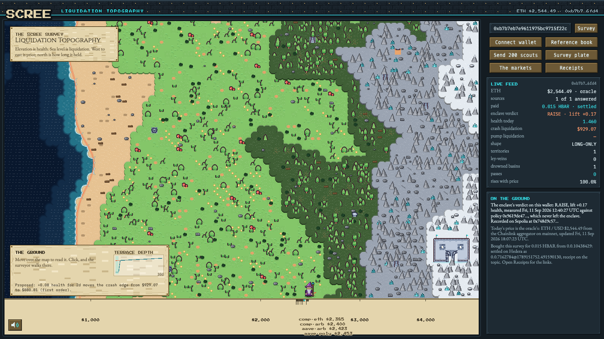
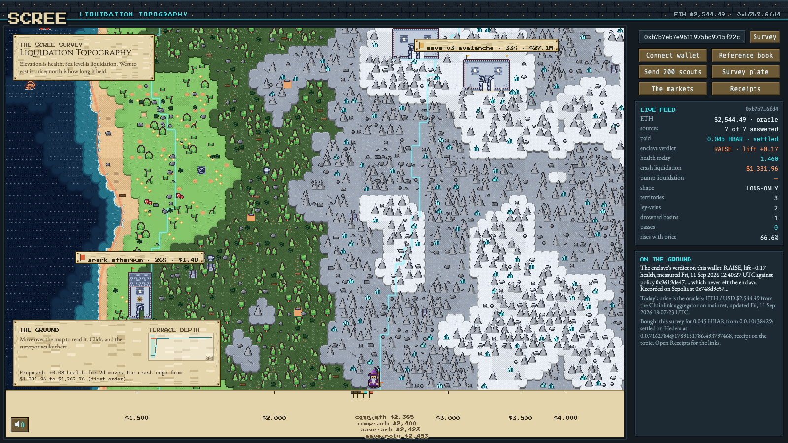
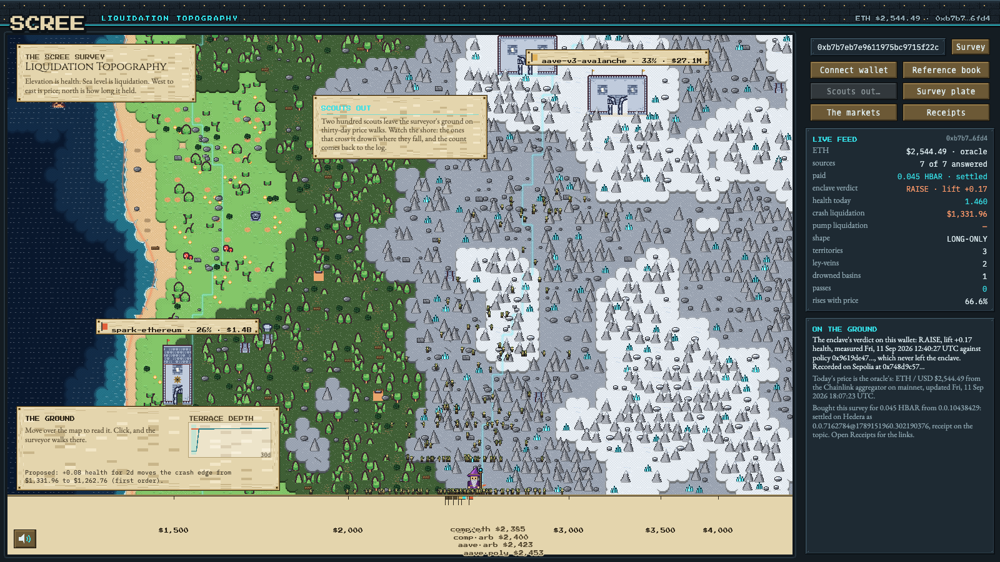
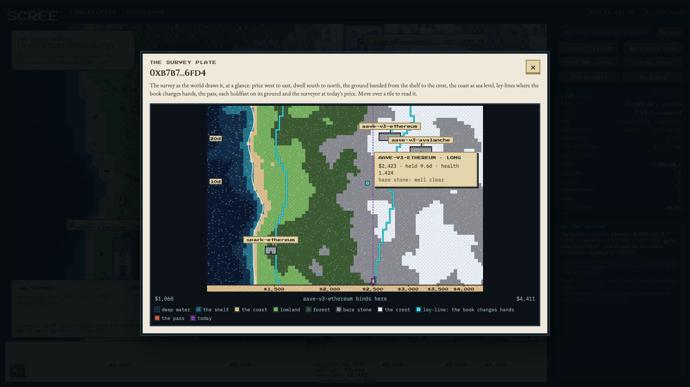
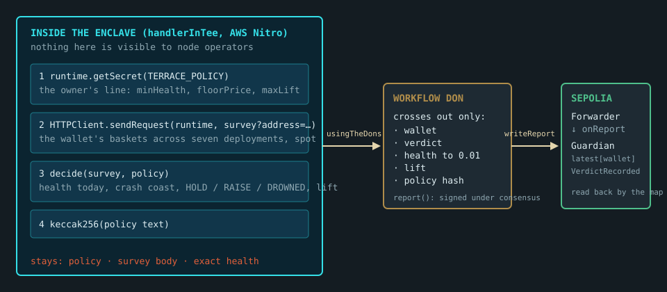

# Scree

**A survey map of how you get liquidated.**

Every lending app reduces your risk to a single number: *"liquidated at $3,434."*
That number is a scalar standing in for a field. It is computed as if the rest
of the market froze and as if time never passed, and it is most wrong exactly
when it matters. Scree draws the field the number stands in for, and draws it
as a place you can walk: an island whose height is your health, whose sea level
is liquidation, and whose borders are the lines no dashboard can show, where one
protocol stops being the thing that kills you and another takes over.

## One query, seven deployments

Scree has no per-protocol code. It asks Aave v3, Compound v3 and Spark, on
mainnet, Arbitrum, Polygon and Avalanche, the same GraphQL query, because all
seven deployments publish the Messari Standardized Lending schema. The query
(`src/graph/query.ts`) names no protocol. Adding a deployment costs one row in
`src/registry/deployments.ts`; there is no adapter to write.

That is not a convenience, it is where the map's structure comes from. The
seven answers arrive in one shape, so they can be minimised against each
other at every point of price × dwell. The lowest health wins, and which one
won is the tile's owner. The **territories** on the map are that argmin
partition; their borders are the **folds**, the points where the deployment
closest to liquidating you hands over to a different one. A single deployment
cannot have a fold. Seven standardized ones do.

You can watch the standard do this work. The same live wallet, surveyed on
the site, first from one deployment and then from all seven. Nothing in the
code changed between the two pictures; only how many standardized answers
were minimised.



`?sources=aave-v3-ethereum`: one territory, one coast, no borders. The feed
says `1 of 1 answered`, `territories 1`, `ley-veins 0`.



The same address from all seven: three territories, two folds, a holdfast on
each with the size of its market on the banner. `7 of 7 answered`,
`territories 3`, `ley-veins 2`. A single deployment cannot have a fold.

The data path, in `src/graph/`:

- `fanOut` sends the query to every deployment at once through the gateway,
  with the key kept server-side (`/api/terrain`). A deployment that is down,
  rate-limited or has never heard of the address is recorded as failed and the
  scan continues; the response names `healthy`, `failed` and a block height per
  deployment, so every number on the map can cite its source and its age.
- `normalize` turns the schema's string numbers into numbers and its
  percentage ratios into ratios. `liquidationThreshold` arrives as `82.5`, not
  `0.825`, which is the single most common way to get a liquidation price
  wrong by a factor of a hundred; the guard refuses to divide twice.
- `reduce` folds the legs into one basket per deployment: charted-asset
  collateral and debt, everything else held constant, and the rates.

## The second question, in the same shape

The first query asks what one address holds. The second, `Markets` in
`src/graph/query.ts`, asks what each market *is*: how much is in it, how much
is borrowed, at what threshold it liquidates, how far a fresh borrower may
lever, and what it pays. It goes to the same seven deployments through the
same fan-out (`src/graph/markets.ts`, `/api/markets`), and it names no
protocol either. That is what lets a holdfast's plaque be filled from the same
fields whichever seat it is.

Three things on screen come from it:

- **The markets** window (the wide button in the column): one row per
  deployment, every column from the one query, with the block each was read
  at.
- **Sizes on the banners**: each holdfast's banner carries the size of that
  deployment's market in the charted asset.
- **High-water marks on the scale**: one flag per deployment at the price
  where a borrower who opened at the maximum LTV today is liquidated. The
  arithmetic is one line for all of them: today's price × max LTV ÷
  liquidation threshold. A fresh maximum-leverage position stands on that
  cliff, and the flags show how far apart the seven cliffs are.

## Asking the survey, through a second Graph product

`npm run ask -- "how healthy is 0x…"` answers from the same seven
deployments without the map, and without the registry's ids being typed
anywhere in the request: it opens The Graph's Subgraph MCP server, finds each
deployment by keyword through the MCP's search tool, runs the one
`WalletPositions` query on each through the MCP's query tool, and feeds the
answers to the same normaliser and reducer the map uses. The question is
matched to a reading (health, where it liquidates, which deployment binds
first); the numbers are the survey's, not a paraphrase. Two Graph products
composed over one standardized schema, and the answer agrees with the map to
the digit.

```
  aave-v3-ethereum       found "Aave V3 Ethereum" by keyword
  …
  spark-ethereum         found "Spark Lend Ethereum" by keyword

0xb7b7eb… has health 1.497 at $2,611 across 3 deployments (aave-v3-ethereum, aave-v3-avalanche, spark-ethereum); shape LONG-ONLY.
Nearest liquidation $1,332 on spark-ethereum.
```

## On screen

**The door.** A landing scene: the same terrain the survey draws, drifting
under a dark veil, with a stone console holding one real text input for an
address and two brass buttons, Begin survey and Connect wallet. The reference
book opens first; a wallet's own book replaces it when the query returns.

**The island.** Eighty by fifty-two tiles. Deep water, a shallow shelf and an
abyss on both sides; sand coasts with coves; lowland grass with deciduous
trees; midland pine forest and rock; a broad range with a snow crest. The sea
rolls through eight frames and foam breaks on the shore. A ruled price scale
runs under the map.

**Holdfasts.** One seat per deployment, on the highest ground its territory
rules: Aave's battlemented castle, Spark's roofed tower with a turning gear
and a smoking chimney, Compound's red-roofed manor with windows that glow. A
banner floats over each with the deployment and its share of the ground. Walk
up to one and it greets you with its liquidation threshold.

**Faults.** The territory borders are chains of crags over a ley line that
breathes, denser and studded with ruins on the pass, where a long book meets a
short one, because that crest is the only place the ground can be crossed in
both directions.

**The surveyor.** A figure at today's price with a levelling staff. Click
anywhere and he walks there; where he stands is a scenario, and the log records
the reading. Walk into the sea and he drowns, and the log names which
deployment took the book. Click a seat, the peg at today's price or the surveyor
himself and the camera comes in; double-click the ground and it goes back out.

**Leviathans.** Three sea monsters patrol the deep water, dive and surface,
and warn on hover: slippage, cascading liquidation, oracle drift, each with the
depth of the water it swims in and whose water it is.

**The reading panel.** Hover anywhere and the box in the corner names the
deployment that owns the ground, the price, the dwell, the health factor and
the exact liquidation threshold at that dwell. Beside it, the terrace-depth
graph: the crash edge against dwell, and where a proposed lift in health would
move it.

**Scouts.** Two hundred scouts, small soldiers, march out on simulated
thirty-day price walks from where the surveyor stands. The ones that cross the
shoreline drown where they fall, sunk to the chest in the foam; the log reports
how many came home.



**The plate.** The survey drawn the way the world draws the ground, one click
away: the same terrain grid painted tile by tile in the tileset's palette, the
coast in foam, the borders as ley-lines, the pass, each holdfast as a keep with
its banner, today's price where the surveyor stands, and the price and dwell
scales. Under the pointer, a reading of the tile and what binds there.



**Sound.** A slow theme at the door, a march for the survey, a quicker one
while the scouts are out; footsteps as the surveyor walks; a sound for each
thing that happens, from a button to a drowning. All of it is synthesised in
the browser with the Web Audio API from the tunes in `src/game/music.ts`, no
audio files, and the speaker button at the foot of the map, bottom left, on
the door too, remembers your choice. A browser plays nothing before the first
click, so the door is quiet until you touch it.

## How the ground is drawn

The map is a Phaser 4 game in three scenes. `LandingScene` is the door.
`WorldScene` (`src/game/WorldScene.ts`) owns the camera and everything
standing on the ground; `UIScene` is launched over it and owns the instrument:
the top bar, the bezel, the live feed, the log, the reading panel, the banners
and the pop-ups, every box a nine-slice of baked pixel-art stock. The world
raises events; the interface listens. Neither scene does arithmetic; the page
hands them a terrain grid and a `readAt` function built from the kernel, and a
book that arrives later restarts the world on it.

The grid comes from `src/game/terrain.ts`. The kernel is evaluated at tile
corners and banded into seven biomes. Each tile records the lowest band among
its four corners and a 4-bit mask of the corners that rise above it, so every
tile shows exactly one transition and neighbouring tiles agree along the
corner they share. `src/game/tileset.ts` paints the tileset at load from
colours sampled off the Kenney sheet: eight rolling frames per water band,
four frames of foam on the shore, a lit lip and a cliff face on every land
step. The shoreline is traced by marching squares through the drawn heights;
borders are the argmin edges; seats are the highest ground each territory owns,
clear of the map's edge.

Health depends on price far more than on dwell, so the raw field is a set of
vertical stripes. Two things bend it into a landscape without moving sea level
(`RELIEF` in `terrain.ts`): a domain warp lets the price axis wander with map
height, and the same warp is applied to every reading, so what the map shows at
a point is what the book says there; and simplex noise on the height fades to
nothing at the shore and is clamped so it never crosses it. The map and the
arithmetic were checked to agree, wet or dry, on every one of the 4,160 tiles.
Water is banded by fraction of the window's floor into shelf, deep and abyss,
so every book has all three however deep its sea goes; land by fraction of its
ceiling, with rock from the forest line to the snow line.

Everything standing on the land is a rule of the tile under it
(`src/game/clutter.ts`): driftwood on the coast, deciduous trees on the plains,
dense pines and rock in the midlands, peaks, ruins and aether crystals on the
heights, grouped by a slow noise into groves and fields. Depth is strict: water
at 0, the paper margin at 5, terrain at 10, the lines above it, everything on
the ground y-sorted inside 20 to 24, particles and scouts above that, the
interface from 90 and its pop-ups at 100.

## Why the ground has shape

Each position moves with price in one direction only. Supply ETH and borrow
stablecoins and you are **long**: price up is safer. Borrow ETH against
stablecoins and you are **short**. In `src/core/kernel.ts`:

```
HF(P, t) = ((a·P + c) · exp(rs·t)) / ((u·P + v) · exp(rb·t))
```

The derivative of that with respect to `P` has numerator `a·v − u·c`, which
carries no `P` at all. So a single position is monotone in price everywhere and
can never turn around. **All structure on the map comes from which position is
lowest**, not from any one of them bending.

Which means:

- A book that is entirely long renders an honest **ramp**. One shoreline, no
  ridge, no pass. The interface says so rather than drawing creases that are
  not there.
- A book holding **both signs** has one position that kills you on the way down
  and another on the way up. Between them is a ridge, and the highest point on
  it is the **pass**, the best health this book can reach at any price.

For two pure legs the ridge sits exactly at the geometric mean of the two
liquidation prices, and the crest is `sqrt(upper/lower) − 1`. That closed form
is in `src/core/bracket.ts` and it reports when it does *not* hold, because an
affine leg shifts the ridge off the mean.

## Paying for a survey

The reading the map draws is also a thing an agent can buy. `/api/survey` is
the same survey as `/api/terrain`, gated by [x402](https://github.com/x402-foundation/x402)
on Hedera, settled through the [Blocky402](https://blocky402.com/)
facilitator, and metered by what it asks for.

### Setup

Two Hedera testnet accounts with ECDSA keys: one receives (the service) and
one pays (the platform's own agent, which is also what `scripts/scout.ts`
pays with). The portal faucet at portal.hedera.com creates and funds an
account from an EVM address. Then:

```bash
cp .env.example .env.local      # HEDERA_ACCOUNT_ID, HEDERA_PRIVATE_KEY, AGENT_HEDERA_ACCOUNT_ID, BURNER_PRIVATE_KEY, PUBLIC_URL
npm run hedera:topic            # creates the receipts topic; put the id in HCS_RECEIPTS_TOPIC
npm run dev                     # /api/survey now answers 402 without payment
npm run scout -- --address 0xb7b7eb7e9611975bc9715f22ce7e6ee288296fd4 --budget 0.5 --service http://localhost:3000
```

The facilitator is pinned, not defaulted. From `src/x402/service.ts`:

```ts
// Pinned on purpose. The reference implementation defaults testnet to a
// generic facilitator; this service settles through Blocky402 on both.
return network.endsWith("mainnet") ? "https://api.blocky402.com" : "https://api.testnet.blocky402.com";
```

Testnet needs no facilitator key. The price schedule is two numbers in the
environment, `SURVEY_BASE_TINYBAR` and `SURVEY_PER_SOURCE_TINYBAR`.

### Architecture

```
buyer (the map's own account, or the scout)          service (this app)                 Hedera
──────────────────────────────────────────           ───────────────────────            ───────────────────
GET /api/survey/manifest ───────────────────────────▶ endpoint, rail, prices, topic
GET /api/survey?address=… ──────────────────────────▶ 402 + PAYMENT-REQUIRED (exact quote)
sign HBAR transfer for the quote
GET … + PAYMENT-SIGNATURE ──────────────────────────▶ verify ─────────────────────────▶ Blocky402 /verify
                                                      run the survey (one query, seven deployments)
                                                      settle ─────────────────────────▶ Blocky402 /settle → transfer on Hedera
◀──────────────────────── 200 + settlement header ──┘
                                                      receipt ────────────────────────▶ HCS topic 0.0.10439715
```

The pieces: `src/x402/pricing.ts` (the schedule), `src/x402/service.ts` (the
gate: resource server, facilitator client, receipt hook), `src/x402/buyer.ts`
(the platform as a buyer), `src/app/api/survey/` (the paid route and the
manifest), `src/hedera/receipts.ts` (writing the topic), `src/hedera/trail.ts`
(reading it back), `src/app/api/receipts/` and the **Receipts** window.

### Payment flow

1. A buyer that has never seen the service reads `/api/survey/manifest`, or
   the same document at `/.well-known/x402` if all it knows is the host: the
   endpoint, the rail (x402 `exact` scheme, HBAR on `hedera:testnet`, the
   service account it pays), the price schedule with a worked example, which
   deployments can be asked, and the topic where receipts are written.
2. It requests the survey with no payment and gets `402 Payment Required`.
   The `PAYMENT-REQUIRED` header names the exact price for that request:
   a base charge plus a charge per verified deployment asked, so a survey of
   two sources costs less than a survey of seven, and nothing is charged for a
   deployment the registry cannot vouch for, because it is never asked.
3. It signs a Hedera transfer for that amount with its own ECDSA key and
   retries with the signed transaction in the `PAYMENT-SIGNATURE` header.
4. The service asks the facilitator to verify the payment, runs the survey,
   and only then has the facilitator settle the transfer on Hedera. If the
   survey fails, the payment is cancelled rather than settled. The settlement
   transaction id comes back in the response headers.
5. After settlement the service writes one message to the Consensus Service
   topic: what was asked, what was paid and by whom, the settlement
   transaction, and the SHA-256 of the body exactly as it was sent. A buyer
   can hash what it received and find that digest on the public topic.

The map is itself a buyer. Every survey a visitor makes on the site is bought
from `/api/survey` by the platform's own account, the way any other agent
buys it, and the settlement comes back with the reading: the feed shows
`paid · 0.045 HBAR · settled`, the log names the transaction, and the
**Receipts** window lists the topic read back through the mirror node, every
row linked to the explorer. If the purchase cannot be made the survey is read
directly and the reason is named, so the map is never blank because a payment
rail was.

The other buyer is `scripts/scout.ts`, an agent with a budget in HBAR. It
discovers the service from the manifest, refuses any request that would
exceed its budget or a price above the quote it expected, pays, prints the
reading with the settlement link, and then reads the topic back until it
finds the receipt for its own transaction and confirms the digest matches.
Pass `--every 10` to re-survey on a schedule until the budget is spent.

Every buyer says who it is. The scout and the platform each derive an
[HCS-14](https://hashgraphonline.com/docs/standards/hcs-14/) identifier
from their name and Hedera account (`src/agent/identity.ts`: the six
canonical fields, SHA-384, Base58, the routing parameters in order), send it
with each purchase, and the service copies a well-formed one into the
receipt. The Receipts window shows which identity paid. Anyone can recompute
the identifier from the same public inputs; no registry is consulted.

A standing survey is paid for ahead, on the ledger's clock rather than a
timer in the buyer. `npm run scout -- --address 0x… --schedule 3 --every 10`
creates three Hedera Scheduled Transactions: transfers to the service that
the network executes by itself at their expiry, each carrying the memo
`scree:standing:<address>[:<sources>]`. The steward (`npm run steward`, or
`--watch` on the service) reads the service account's transfers from the
mirror node, finds executed scheduled ones with that memo it has not yet
honoured, runs each survey, and writes a receipt marked `standing` with the
scheduled transfer as its settlement. Two ran on testnet: schedules
[0.0.10477153](https://hashscan.io/testnet/schedule/0.0.10477153) and
[0.0.10477154](https://hashscan.io/testnet/schedule/0.0.10477154), receipts
#18 and #19 on the topic.

A second rail is written and waits on test funds: `npm run hedera:credits`
issues SRV, a survey-credit token whose fee schedule returns a fiftieth of
every transfer to the service, associates the agent and sends it credits;
the service then offers a second `accepts` entry priced one credit per
source plus one, the manifest names both rails, and `--rail credits` makes
the scout pay in credits. Issuing a token with a fee schedule costs about
two dollars of test HBAR at the network's rate, more than the service
account holds today.

```
price     0.01 + 0.005 × 7 sources = 0.045 HBAR per survey
== 0xb7b7…6fd4
  paid      0.045 HBAR for 7 sources, in 4.6s
  settled   0.0.7162784@1788961026.599308167
  spot      $2,509   health 1.472   shape LONG-ONLY
  receipt   topic 0.0.10439715 #1, digest matches what I received
```

### A receipt, decoded

Message #8 on topic
[0.0.10439715](https://hashscan.io/testnet/topic/0.0.10439715), as the
mirror node returns it and `src/hedera/trail.ts` decodes it:

```json
{
  "v": 1,
  "kind": "survey",
  "at": "2026-09-11T12:42:33.390Z",
  "address": "0xb7b7eb7e9611975bc9715f22ce7e6ee288296fd4",
  "asked": [
    "aave-v3-ethereum",
    "aave-v3-arbitrum",
    "aave-v3-polygon",
    "aave-v3-avalanche",
    "compound-v3-ethereum",
    "compound-v3-arbitrum",
    "spark-ethereum"
  ],
  "healthy": [
    "aave-v3-ethereum",
    "aave-v3-arbitrum",
    "aave-v3-polygon",
    "aave-v3-avalanche",
    "compound-v3-ethereum",
    "compound-v3-arbitrum",
    "spark-ethereum"
  ],
  "spot": 2486.17991714,
  "shape": "LONG-ONLY",
  "payer": "0.0.10438429",
  "payTo": "0.0.10438442",
  "network": "hedera:testnet",
  "asset": "0.0.0",
  "amount": "4500000",
  "transaction": "0.0.7162784@1789130544.123126771",
  "bodySha256": "031fa62dffdbcf5d43e8a25b1dee4f2d1b2332581d2b5a7f27b43b94d43e3987"
}
```

`amount` is tinybar. `transaction` is the settlement the facilitator
submitted, viewable on HashScan. `bodySha256` is the digest of the exact
bytes the buyer received.

## The private terrace

The owner of a wallet has a line in the field: the health they refuse to fall
below, the price they refuse to be liquidated above, how much of a lift they
will buy. If that line were public, so would be the level at which to push.
`cre/` holds a Confidential Workflow for the
[Chainlink Runtime Environment](https://docs.chain.link/cre) that keeps it
private: a handler registered with `handlerInTee` fetches the policy as a
Vault DON secret inside the enclave, fetches the wallet's survey from inside
the enclave, decides `HOLD`, `RAISE` or `DROWNED` with the same kernel the map
uses, and crosses back to the DON with the verdict, a coarse health, the
lift and the hash of the policy, nothing else. The DON signs it and a
forwarder delivers it to the `Guardian` ledger on Sepolia. Survey the wallet
on the site and the map reads that slot back: the feed shows the enclave's
verdict, the terrace caption carries the policy hash, and the log says where
it is recorded.



It runs in the CRE simulator, and with `--broadcast` the verdict lands on the
real ledger; `cre/evidence/` holds transcripts of both and the ledger read
back. The ledger is at
[`0x748d9c57…1bd2`](https://sepolia.etherscan.io/address/0x748d9c5791059f97dcaf950c6fe92c6b80451bd2),
and `npm run guardian:read` prints its latest verdict for a wallet. See
[`cre/README.md`](cre/README.md) for the flow and the arithmetic.

## The geometry gate

It is easy to write a renderer that draws convincing creases over terrain that
is really a smooth ramp. `npm run gate` measures the actual raster and fails the
build when the drawing and the measurement disagree.

```
  wallet shape               MIXED
  binders                    3
  fold lines (8-connected)   2
  basins                     2
  pass                       $4,165.43
  pass elevation             0.160576
  boundary pass              true
  rises with price on        68.997% of steps
  crest drift over dwell     1.00 px
  lower shore drift          0.56 px
  upper shore drift          0.24 px

  verdict                    TOPOGRAPHY
```

## Honest limits

- **The dwell axis moves the terrain very little.** Over the full 30 days the
  shorelines shift 0.56 and 0.24 pixels on a 320-pixel axis. That is interest
  accrual and nothing else, and accrual is slow. The gate prints the number
  every run. The map does not sell the bend.
- **Relief is relief.** The coves and plateaus come from a warp and a noise
  that are documented, applied to every reading, and forbidden from touching
  sea level. They make the map readable; they do not add information.
- **Two axes only.** One asset's price and how long it stayed there. Everything
  else the wallet holds is held constant, and collateral in a third volatile
  asset is badged on screen rather than quietly folded in.
- **The registry is a subset.** A map drawn from four of seven sources is still
  worth reading, but only because it names the three that did not answer.
- **ETH is ETH whatever receipt it is held as.** stETH, wstETH, weETH, rsETH,
  osETH and the rest of the family are counted as the charted asset, each at
  its own price against spot, so a staking loop reads as flat rather than as a
  short that drowns at the first pump. Spot itself is the oracle's: the
  Chainlink ETH/USD aggregator on mainnet, the number the protocols
  themselves liquidate against, taken when it is under two hours old and
  within a fifth of what the deployments report; otherwise the deployments'
  median. The feed says which, and the log names the round.
- **What the schema cannot explain is set aside, not drawn.** A position that
  is open on-chain but under water by the schema's own liquidation thresholds
  is being held up by something the schema does not carry, an efficiency mode
  almost always. Flooding the map with a liquidation that is not happening
  would be a lie, so that deployment is excluded from the terrain and named in
  the feed with its computed health, and the survey says so.
- **The reference book is a fixture.** It loads before any key is set so the
  map works out of the box. A surveyed address is live data, and the feed shows
  the block height it was read at.

## Running it

```bash
npm install
npm run dev
```

The page loads a reference book with no configuration, so the map works before
any key is set. To survey a real address, set a gateway key:

```bash
cp .env.example .env.local   # then fill in GRAPH_API_KEY
npm run verify:subgraphs     # resolve every registry id before trusting it
```

`verify:subgraphs` asks each id, through the gateway, for its block, its
protocol entity and its largest market with a liquidation threshold, and
passes it only if all three come back in the lending shape. It writes
`src/registry/verified.json`, which is committed so the check is on the
record, and `/api/terrain` refuses to ask a deployment that record does not
vouch for; such a deployment is named in `unverified` in the response rather
than dropped. The seven ids are Messari's own publications on The Graph
Network. Aave v3 and Compound v3 on Base, and Aave v3 on Optimism, were left
out because the network does not serve them today; when it does, each is one
registry row.

| Script | What it does |
|---|---|
| `npm run dev` | development server |
| `npm test` | the full suite, 184 tests |
| `npm run gate` | measure the terrain and fail on a flat map |
| `npm run typecheck` | types |
| `npm run verify:subgraphs` | resolve every subgraph id against the gateway |
| `npm run hedera:topic` | create the HCS topic that receives survey receipts |
| `npm run scout -- --address 0x…` | an agent that discovers, pays for and verifies a survey; `--schedule N --every M` pays ahead; `--rail credits` pays in SRV |
| `npm run steward` | honour executed scheduled payments with surveys and receipts (`--watch` to keep going) |
| `npm run ask -- "…0x…"` | answer a question from the seven deployments through the Subgraph MCP |
| `npm run hedera:credits` | issue the survey-credit token and fund the agent with it |
| `npm run guardian:deploy` | compile and deploy the verdict ledger to Sepolia |
| `npm run guardian:read` | read the ledger's latest verdict for a wallet |
| `npm run bake:sprites` | regenerate the baked sheets under `public/assets/scree/` and the site icon |
| `npm run pictures -- <url> docs` | capture the pictures in this file from a running site with headless Chrome |
| `npm run build` | production build |

Query parameters: `?address=0x…` opens the survey on that wallet straight
from the link, and `?sources=id,id` restricts the registry, so the difference
one schema makes is reproducible by anyone from the address bar.

The canvas is drawn at the screen's own pixel density and the pixel art is
scaled up in-game, so type stays sharp on any display. On a phone the
instrument column moves under the map, a tap reads the ground and walks the
surveyor there, and two fingers zoom.

A live survey runs at [scree.hacklabs.in](https://scree.hacklabs.in). Two
public addresses that borrow on more than one deployment, if you want ground
with borders before connecting your own wallet:

- `0xb7b7eb7e9611975bc9715f22ce7e6ee288296fd4`: Aave v3 on mainnet, Aave v3 on
  Avalanche and Spark, three territories along the price axis with two folds
  and a plateau.
- `0x7df25ed19086f00e0539c7c9a2a6234e0689905e`: Aave v3 on mainnet and Compound
  v3 on mainnet and Arbitrum, one fold above spot.

## Layout

| Path | What lives there |
|---|---|
| `src/core` | the kernel, liquidation prices, the bracket, wallet shape, fixtures |
| `src/graph` | the two queries, the gateway fan-out, normalisation, reduction to baskets, the markets |
| `src/registry` | the deployments, all one schema, and their verification |
| `src/survey` | the survey itself, shared by the free route and the paid one |
| `src/x402` | the price schedule and the payment gate |
| `src/hedera` | receipts on the Consensus Service, and the trail read back |
| `src/oracle` | the Chainlink ETH/USD aggregator as today's price |
| `src/agent` | HCS-14 identifiers for buyers |
| `cre` | the confidential workflow, its ledger contract, and the evidence of its runs |
| `src/field` | the raster and its features |
| `src/render` | contours and hachures for the geometry gate, the plate's palette and scale |
| `src/sim` | the price walks the scouts follow |
| `src/game` | terrain, tileset, clutter, holdfasts, the three scenes, the surveyor and the leviathans |
| `scripts` | the geometry gate, the subgraph verifier, the sprite bakery, the topic maker, the scout |

## What it will never ask for

Scree reads public positions. It does not request a token approval, hold a key,
or move anyone's funds. Connecting a wallet asks for an address and nothing
else. Where a defence policy is armed, the system returns an action and a size;
executing it stays the owner's own transaction.

## Assets

Sprites are from two CC0 packs by [Kenney](https://kenney.nl): Tiny Town and
Tiny Dungeon, committed with their licences under `public/assets/kenney/`.
The sheets under `public/assets/scree/` are generated by `npm run bake:sprites`
(`scripts/bake-sprites.ts`, with its own PNG codec): the surveyor's forty
frames are drawn from a pose, the leviathans' swim, dive and surface frames are
derived from single Tiny Dungeon frames, the scouts are small soldiers drawn
from a stride and a bob, and the clutter, peaks, particle motes
and interface stock are drawn from the project's palette. The terrain tileset
itself is painted at load from colours sampled off the pack. The pixel face is
Press Start 2P, served through `next/font` like the other three.

## Licence

MIT. See [LICENSE](LICENSE).
